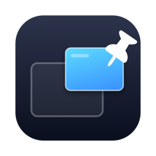

<div align="center">

  

  <h1>GhostPin</h1>

  <p><b>Pin any window on top. Ghost it when it's in the way.</b></p>

  <p>
    Keep a live, always-on-top mirror of any window floating over your work —<br/>
    then make it click-through so it never gets in your way.
  </p>

<p>
  <a href="https://github.com/AadhilFarhan/GhostPin/actions/workflows/build.yml"></a>
  <a href="https://github.com/AadhilFarhan/GhostPin/blob/main/LICENSE"></a>
  <a href="https://github.com/AadhilFarhan/GhostPin/releases/latest"></a>
  <a href="https://github.com/AadhilFarhan/GhostPin/releases"></a>
  <a href="https://github.com/AadhilFarhan/GhostPin/stargazers"></a>
</p>

  <p>
    <a href="https://github.com/AadhilFarhan/GhostPin/releases/latest/download/GhostPin.dmg"><b>Download</b></a>
    &nbsp;·&nbsp;
    <a href="https://aadhilfarhan.github.io/GhostPin/">Website</a>
    &nbsp;·&nbsp;
    <a href="#installation">Install guide</a>
    &nbsp;·&nbsp;
    <a href="#build-from-source">Build from source</a>
  </p>

</div>

---

macOS has no "always on top." The moment you click into another app, the window you were watching gets buried. GhostPin fixes that: pick any window and a small live mirror of it floats above everything — every app, every Space, even full-screen apps. Flip on **ghost mode** and the mirror turns semi-transparent and click-through, so you can see it but your clicks and keystrokes go straight to whatever is underneath.

Watch a tutorial in the corner while you code full-screen. Keep the Zoom call visible while you take notes. Watch a build log while you work on something else.

> [!NOTE]
> GhostPin asks for the macOS Screen Recording permission because its live mirrors work by reading window pixels — **nothing is ever recorded, stored, or uploaded**. The app has no networking code and runs entirely offline. [Details below](#why-does-ghostpin-need-screen-recording-access).

---

## Features

### Pin any window

Click the pin in your menu bar and pick any open window — browser, video call, terminal, chat, anything. A live mirror appears in the corner and stays above everything you do, across every Space and over full-screen apps.

### It's a live mirror, not a screenshot

GhostPin uses Apple's ScreenCaptureKit to stream the window at up to 30 fps, GPU-composited with zero-copy frames. The original window can be buried under ten others or sitting on another desktop — the mirror keeps playing. If the source window resizes, the mirror follows its shape. When it closes, the pin cleans itself up.

### Ghost mode

The signature feature. Press <kbd>⌥⌘G</kbd> and every pinned mirror becomes semi-transparent and **click-through** — your mouse acts like the mirror isn't there. Watch the video *and* click the button underneath it. An accent border shows when a mirror is in ghost mode; press <kbd>⌥⌘G</kbd> again to make it solid.

Every mirror carries a small **eye badge on its top-right corner** that toggles click-through with one click — dark when the mirror is solid, accent-colored when it's ghosted. On a ghosted mirror the badge is the one spot that stays clickable, so you're never locked out: tap it, and the mirror turns solid for dragging and resizing. A hint appears the moment a mirror enters ghost mode, so there's nothing to memorize.

### Size and opacity

Drag the mirror anywhere. Resize it from any edge — it keeps the source's aspect ratio. Double-click to flip between thumbnail and large. Hover for a control strip with a ghost toggle, opacity slider, and unpin button.

### Global hotkeys

Work from anywhere, no clicking required — and no Accessibility permission needed:

| Hotkey | Action |
|--------|--------|
| <kbd>⌥⌘P</kbd> | Pin / unpin the frontmost window |
| <kbd>⌥⌘G</kbd> | Toggle ghost mode (click-through) on all pins |
| <kbd>⌥⌘U</kbd> | Unpin all |

### Private by design

GhostPin has no network code at all. Frames go from ScreenCaptureKit straight to your screen and nowhere else — nothing is recorded, stored, or uploaded. It's a menu bar app with no dock icon, and the full source is in this repo.

---

## Download

<div align="center">

<a href="https://github.com/AadhilFarhan/GhostPin/releases/latest/download/GhostPin.dmg"></a>

</div>

---

## Installation

> [!IMPORTANT]
> GhostPin is not yet notarized by Apple (that requires a paid developer account), so macOS will warn you on first open. The steps below get you through it — or skip the download entirely and [build from source](#build-from-source) in under a minute.

### Install with Homebrew

```bash
brew install --cask aadhilfarhan/tap/ghostpin
```

One command, and Homebrew verifies the download's checksum for you automatically. Steps 4–5 below (allowing the app and granting Screen Recording) still apply on first open. Updating later is `brew upgrade --cask ghostpin`.

The steps below cover the direct download instead.

### Step 1: Download

[Download GhostPin.dmg](https://github.com/AadhilFarhan/GhostPin/releases/latest/download/GhostPin.dmg) — this link always fetches the newest release. Release notes live on the [releases page](https://github.com/AadhilFarhan/GhostPin/releases).

### Step 2: Verify your download (optional but recommended)

Each release includes a `.dmg.sha256` checksum file ([download it here](https://github.com/AadhilFarhan/GhostPin/releases/latest/download/GhostPin.dmg.sha256)). With both files in the same folder:

```bash
cd ~/Downloads
shasum -a 256 -c GhostPin.dmg.sha256
```

A result ending in `OK` means your download is byte-for-byte the published release.

### Step 3: Install

Open the `.dmg` and drag GhostPin to your Applications folder.

### Step 4: First open

Because the app isn't notarized, double-clicking will show a warning:

1. Double-click GhostPin, and dismiss the warning
2. Open **System Settings → Privacy & Security**, scroll down, and click **Open Anyway** next to the GhostPin message
3. Confirm in the dialog that appears

You only do this once.

### Step 5: Grant Screen Recording

GhostPin mirrors windows using screen capture, so macOS requires the Screen Recording permission:

1. Approve the prompt (it takes you to **System Settings → Privacy & Security → Screen & System Audio Recording**)
2. Enable the toggle next to GhostPin
3. Quit and reopen GhostPin (macOS requires this after granting)

The pin icon appears in your menu bar. Click it and pin your first window.

---

## Updating

GhostPin checks nothing and phones home to nothing, so updates are manual: download the new `.dmg` from the [releases page](https://github.com/AadhilFarhan/GhostPin/releases) and drag-replace the app.

> [!NOTE]
> Until releases are notarized, macOS ties the Screen Recording grant to the exact binary. After replacing the app with a new version, re-grant it: System Settings → Privacy & Security → Screen & System Audio Recording → toggle GhostPin off and on, then reopen the app. This annoyance disappears once releases are signed with a Developer ID.

---

## How it works

Apple provides no public API to force another app's window to stay on top — that's a real OS restriction, not a missing feature. GhostPin doesn't fight it: instead of moving the target window, it streams a live capture of it (ScreenCaptureKit's per-window filter) into a floating panel GhostPin fully controls. That panel can sit above everything, ignore mouse clicks, and go transparent — things macOS happily allows for your *own* windows.

The one trade-off: the mirror is view-only. To interact with the pinned window — pause the video, type a reply — click the *original* window as usual; the mirror shows whatever happens instantly. In ghost mode your clicks pass through the mirror to whatever app is under it.

---

## Why does GhostPin need Screen Recording access?

Because of how the mirror works. macOS does not allow one app to move another app's window on top, so GhostPin instead *displays a live copy* of the window's pixels — and reading the pixels of other apps' windows is exactly what macOS classifies as "screen recording." There is no narrower permission Apple could grant for this; every window-pinning app in this category requires the same one.

What the permission is used for — and what it is not:

- **Nothing is recorded.** Captured frames travel from Apple's ScreenCaptureKit straight to your screen, live in memory only, and are discarded immediately. Nothing is ever written to disk.
- **Nothing is sent anywhere.** GhostPin contains no networking code at all — it runs entirely offline and *cannot* upload, sync, or phone home. No analytics, no telemetry, no update pings.
- **No audio is captured.** On recent macOS the prompt is titled "Screen & System Audio Recording" — that's Apple's combined name for the single permission, and apps can't change the dialog's wording. GhostPin's capture stream is video-only; audio capture is never enabled.
- **You don't have to take our word for it.** The complete source code is in this repository — including every line that touches the capture stream — and you can [build the app yourself](#build-from-source) in under a minute.

---

## Build from source

No Xcode required — just the Command Line Tools.

```bash
git clone https://github.com/AadhilFarhan/GhostPin.git
cd GhostPin
./scripts/build-app.sh
open dist/GhostPin.app
```

The script builds the SwiftPM package in release mode and assembles `dist/GhostPin.app`. Building locally also skips the Gatekeeper "Open Anyway" dance, since the binary is built on your own machine.

To regenerate the app icon:

```bash
swift scripts/generate-icon.swift
```

---

## Requirements

- macOS 14.0 (Sonoma) or later
- Screen Recording permission
- Apple silicon or Intel

---

## Privacy

GhostPin runs entirely on your Mac and contains no networking code. Captured frames exist only in memory on their way to your screen. Nothing is recorded to disk, nothing is uploaded, no analytics, no update pings.

---

## Limitations

- The mirror is **view-only** — interact with the original window, not the mirror
- DRM-protected content (Netflix, Apple TV+) may render black in the mirror, as it does in all screen capture
- Ghost mode makes the mirror's surface untouchable while active — use the corner eye badge or <kbd>⌥⌘G</kbd> to toggle back

---

## License

GhostPin is released under the [MIT License](LICENSE). You are free to use, read, modify, and distribute it.

---

<div align="center">

**Aadhil Farhan**

<a href="https://github.com/AadhilFarhan"></a>

</div>
